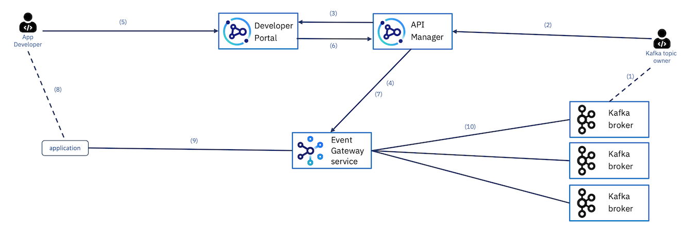
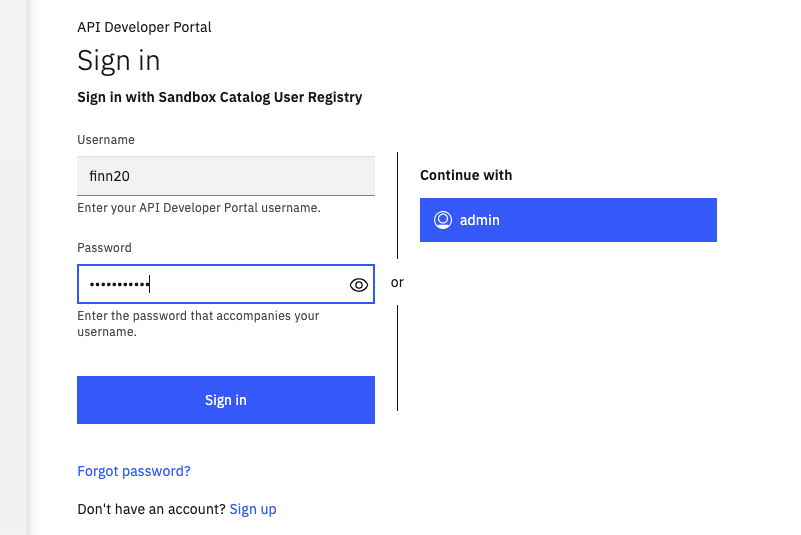

# Event endpoint management

## About this Lab

In this lab, you will learn:

* The Application Developer capability to subscribe to topics easily from Event Endpoint Management (EEM).  
* Consume messages from topics via EEM 

The following diagram explains some the components involved in the lab and the global flow, an API developer will do and an Application developer will also performs.



This lab is NOT about API manager(Kafka topic owner in diagram above) creating asyncAPI for application developers to subscribe to. You will play the role of the App developer and mostly do the steps 5,6,8  and 9.

???+ "References:"
    * Event Endpoint Management:  [https://www.ibm.com/docs/en/cloud-paks/cp-integration/2022.2?topic=capabilities-event-endpoint-management-deployment](https://www.ibm.com/docs/en/cloud-paks/cp-integration/2022.2?topic=capabilities-event-endpoint-management-deployment)
    * Understanding [AsyncAPI and Kafka topic article](https://ibm-cloud-architecture.github.io/refarch-eda/patterns/api-mgt/#describing-kafka-with-asyncapi)
    * [Dale Lane's blog](https://dalelane.co.uk/blog/?p=4380)


## Lab Prerequisites

1.	Access to a API Connect Developer Portal  
2.	The KafkaClient used in the Schema Registry lab. 

## Lab Procedures

1.	Open the Developer portal (link provided in table below) and register a login for yourself (if this is the first time you are logging in. You need a real email address and you can use one of the student userid). If you already have a username created, login to the portal. For users who are creating the login for the first time, you will receive an email for confirmation. 

    Please use one of these URLs to access the Developer Portal, matching the userid you have:

    | Host | URL |
    | --- | --- |
    | Ventress | [Ventress API Portal](https://apim-demo-ptl-portal-web-cp4i-apic.apps.ventress.coc-ibm.com/ventress-admin-porg/sandbox) |
    | Cody| [Cody API portal](https://apim-demo-ptl-portal-web-cp4i-apic.apps.cody.coc-ibm.com/cody-admin-porg/sandbox) |
    | Finn | [Finn API portal](https://apim-demo-ptl-portal-web-cp4i-apic.apps.finn.coc-ibm.com/finn-admin-porg/sandbox) |  

    

    then you should reach the portal main home page, with the `TechJam product defined`

    

    

    This portal is coming from the Admin user, and he defined an API product defining AsyncAPI on a customers topic in the event streams running in the OpenShift cluster under `cp4i-eventstreams`.


1. Create an App.

    Go to Apps and Click on “Create a new app”.     Enter a name and click on save.

    

    The API Key and secret will be provided. Take note of it and close the box.
    
    The new app has been created. You can optionally click on ‘Verify’ and enter the secret copied to ensure the credentials you copied are correct. 

3.	Subscribe to the Product and get connectivity details.   

    In the main portal, Go to "API Products".   
    
    Look for a product and Click on it.

    

    Take note of the connectivity details and click on "Get Access". 
    Refer to the steps in the image below. 
    
    Take note of the following: 

    ```
    topic, bootstrap_server, client_id, sasl_mechanism and security_protocol. 
    ```

    These fields will be needed to establish connection to the EventStreams via EEM. 


    

    

    Click on “Select”.

    Click on the newly created app and proceed to complete the subscription process.

    
    
    You have now subscribed to the AsyncAPI for the `customers` topic running in Event Streams within the same OpenShift cluster as the api management. 

4.	Create the PEM certificate needed while accessing the EEM.

    Run this command from a terminal. 

    ```sh
    echo | openssl s_client -connect EVENT_GATEWAY_URL:PORT -servername EVENT_GATEWAY_URL
    ```

    Example:

    ```sh
    openssl s_client -connect apim-demo-myegw-event-gw-client-apic.apps.cody.coc-ibm.com:443 -servername apim-demo-myegw-event-gw-client-apic.apps.cody.coc-ibm.com
    ```

    The EVENT_GATEWAY_URL is the server URL obtained in step 3. 

    Copy the output lines between BEGIN CERTIFICATE and END CERTIFICATE to a file called eem_truststore.pem. The file should look like this:

    

    Copy the file to `C:\TechJam\EventStreams_Lab\KafkaClient_YYYYMMDD\`


5. Test consuming the data in the topic you have just subscribed using the KafkaClient that you used for the Schema Registry lab.

    * Make a backup copy of the config.properties file in the following folder: `C:\TechJam\EventStreams_Lab\KafkaClient_YYYYMMDD\`
    * Edit the config.properties file and make the following changes. 


    | Field	| Value |
    | --- | --- |
    | enableschemaavro	| false |
    | bootstrap.servers	| Enter the bootstrap_server URL obtained in step 3. |
    | sasl.jaas.config	| Paste this string. Replace the <API_KEY\> and <SECRET\> with the details you obtained in step 2. org.apache.kafka.common.security.plain.PlainLoginModule required username='<API_KEY\>' password='<SECRET\>'; |
    | sasl.mechanism	| PLAIN |
    | security.protocol	| SASL_SSL |
    | topic	 | Name of the topic to consume (obtained in step 3) |
    | ssl.truststore.location	| Point it to the location of the PEM file eem_truststore.pem |
    | ssl.truststore.type	| PEM | 
    | client.id	| Insert the client ID obtained from step 3. |

    The other fields can be left as it is. 

    * Now you can run the KafkaClient to consume data. 

    ```sh
    cd C:\TechJam\EventStreams_Lab\KafkaClient_YYYYMMDD\ 
    java -jar KafkaClient.jar consumer config.properties
    ```

    You should see messages being consumed. 

    !!! note
         EEM can only be used for consuming data. Not for producing data. 
