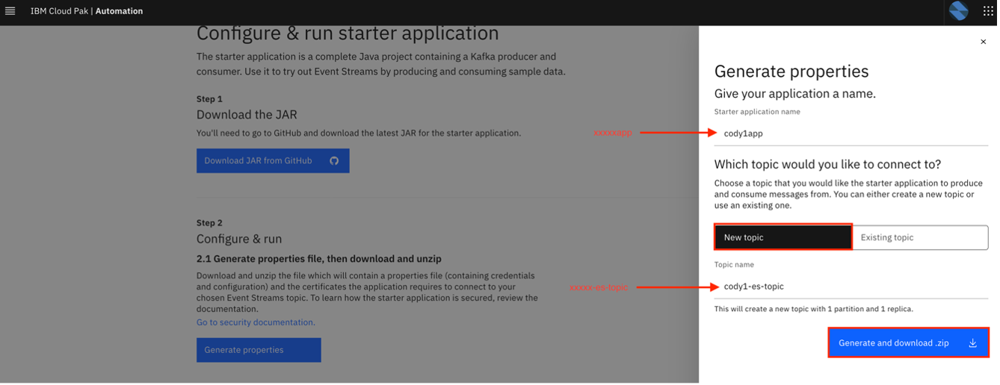
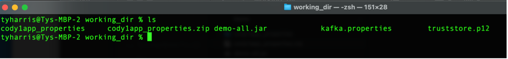
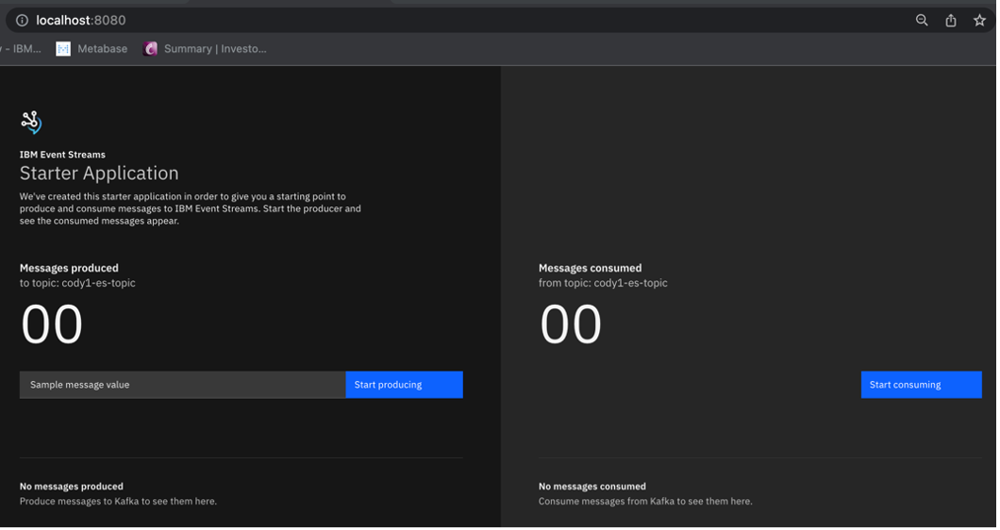

# Getting started with Event Streams

## Introduction and Getting Started

Ty Harris 

IBM Event Streams is based on years of operational expertise that IBM has gained from running Apache Kafka® for enterprises. IBM Event Streams offers enterprise-grade security, scalability, and reliability running on Red Hat® OpenShift® Container Platform as certified container software. Building an event-driven architecture with IBM Event Streams allows organizations to transition from traditional monolith systems and silos to modern micro-services and event streaming applications that increase their agility and accelerate their time to innovation.

IBM Event Streams builds on top of open-source Apache Kafka® to offer enterprise-grade event streaming capabilities. The following features are included as part of IBM Event Streams:

* **Identity and Access Management** (IAM) offers fine-grain security controls to manage the access that you want to grant each user for Kafka clusters, Topics, Consumer Groups, Producers, and more.
* **Geo-replication** enables the deployment of multipleEvent Stream instances in different locations and thesynchronization ofdata between your clusters to improve service availability.
* Visual driven management and monitoring experience with the Event Streams dashboard that displays metrics collected from the cluster, Kafka brokers, messages, consumers, and producers to provide health check information and options to resolve issues

IBM Event Streams enables you to adopt event-driven architectures.

## Lab Objective

The objective of this lab is to demonstrate the step-by-step process to download and install our Starter Apache Kafka application. The starter application provides a demonstration of a Java application that uses the [Vert.x Kafka Client](https://vertx.io/docs/vertx-kafka-client/java/) to send and receive events from Event Streams. The starter application also includes a user interface to easily view message propagation. The source code is provided in [GitHub](https://github.com/ibm-messaging/kafka-java-vertx-starter) to allow you to understand the elements required to create your own Kafka application.

App details: [https://ibm.github.io/event-streams/getting-started/generating-starter-app/](https://ibm.github.io/event-streams/getting-started/generating-starter-app/)

!!! Warning
    The API keys generated for the starter application can only be used to connect to the topic selected during generation. In addition, the consumer API key can only be used to connect with a consumer group ID set to the name of the generated application.
    
## Environment used for this lab

1. IBM Cloud Pak for Integration 
2. Red Hat Openshift Container Platform
3. IBM Event Streams version 11.x
4. Apache Kafka 3.2
5. Java version 11

## Lab Environment Pre-Requisites

* The Cloud Pak for Integration has been deployed and the access credentials are available.
* Java version 11 installed on local environment. Use the [adoptium site to download Java](https://adoptium.net/)
* Apache Maven Installed on local environment.

## Getting started with IBM Event Streams

1. **Click** on one of the link below (depending on the OpenShift cluster allocated to you) to log into your Event Streams instance using the student credentials provided. Once you've logged in, you'll see the Event Streams homepage.

    | Host | URL |
    | --- | --- |
    | Ventress | [https://cpd-cp4i.apps.ventress.coc-ibm.com/integration/kafka-clusters/cp4i-eventstreams/es-demo/gettingstarted](https://cpd-cp4i.apps.ventress.coc-ibm.com/integration/kafka-clusters/cp4i-eventstreams/es-demo/gettingstarted) |
    | Cody| [https://cpd-cp4i.apps.cody.coc-ibm.com/integration/kafka-clusters/cp4i-eventstreams/es-demo/gettingstarted](https://cpd-cp4i.apps.cody.coc-ibm.com/integration/kafka-clusters/cp4i-eventstreams/es-demo/gettingstarted) |
    | Finn | [https://cpd-cp4i.apps.finn.coc-ibm.com/integration/kafka-clusters/cp4i-eventstreams/es-demo/gettingstarted](https://cpd-cp4i.apps.finn.coc-ibm.com/integration/kafka-clusters/cp4i-eventstreams/es-demo/gettingstarted) |  


    

2. **Select** “Try the starter application” tile.

    


3. **Create** a working directory on your local drive then **select** the “Download JAR from GitHub” tab. You’ll want the `demo-all.jar` file for release 1.1.3. 
 
    

4.	**Copy** the downloaded .jar file to your working directory.
 
    

5.	Now let’s generate and download our properties file. **Select** the “Generate properties” tab. 
 
    

6.	**Enter** a name of your app. For guidance, the prefix should be your login ID similar to the example below (i.e. cody1app). This will help us identify which apps are running and who is the owner. **Select** the “New topic” tab and **enter** a topic name. Again, use your login ID as the prefix for your topic name. Now **select** the “Generate and download .zip” tab.
 
    

7.	**Extract** the downloaded .zip file in your working directory. **Copy** the properties file and p12 file to your working directory. Make sure `demo-all.jar`, `kafka.properties` and `truststore.p12` are all in the same directory. 
 
    

8.	Open a terminal and navigate to your working directory. **Enter** the following command:

    ```sh
    java -Dproperties_path=./ -jar demo-all.jar
    ```

    
         	
9.	After your applications starts, open a browser, and **enter**:

    ```sh
    http://localhost:8080 
    ```

    

10.	**Select** the “Start Producing” and “Start Consuming” tabs. 

    


11.	You should soon see messages being produced and consumed.  

    

12.	Now, let’s check our Event Streams cluster to verify our topic creation and monitoring of the messages. To do this, go back to the Event Streams homepage. **Select** “Toolbox”.
 
    

13.	**Select** “Home” to go to the EventStreams homepage.

    

14.	**Select** “Topics” to see the topic you created in the Starter application. Click on your topic to see the Producers, Messages and Consumers.


**Congratulations! You have successfully run your starter application.**

## Learning summary

In summary, you have learned the following in this lab:

* Run an Apache Kafka Java application that has both a producer and consumer.
* View consumer and producer message traffic in IBM Event Streams console.
* Specifying the topic within IBM Event Streams and then connecting an Apache Kafka application to produce and consume messages to and from that topic.

## More code templates (Optional)

To start your Event Streams journey you can use reactive messaging, a Java microprofile extension, and use one of the template from this repository: [eda-quickstart](https://github.com/ibm-cloud-architecture/eda-quickstarts/)

[>> Next - Schema Registry](./schema-lab.md)