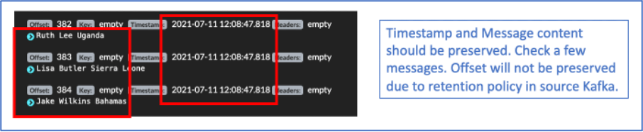

# Configuring and Running MirrorMaker 2 (MM2)

Rajan Krishnan,  IBM

## Introduction

MirrorMaker2,  released  as  part  of  Kafka  2.4.0,  allows  you  to  mirror  multiple  clusters  and create many replication topologies. Learn all about this awesome new tool and how to reliably and easily mirror clusters.

## Lab Objectives

In  this  lab,  we  will  review  the  basic  concepts  of  MirrorMaker2.  You  will  demonstrate  the ability to migrate a topic from a source Kafka to a destination Kafka platform. You will ensure the migration was successful by checking the main properties of topics and consumers and comparing the source / destination Kafka clusters. 

## Pre-Requisites

* Working instance of Event Streams.
* A source Kafka cluster (e.g. Strimzi).

## Understanding MirrorMaker 2 (MM2)

MM2 addresses some of the problems with legacy MM (MM1).

    * Offset translation –avoid duplicates.
    * Consumer group checkpoints.
    * Topics con figurations synced (e.g. partitions, ACLs).
    * MM2 takes advantage of the Connect ecosystem. 
    
MM2 has 3 main components / connectors.

1. MirrorSourceConnector
        
    * Replicates remote topics, topic configurations.
    * Emits Offset syncs2

1. MirrorCheckPointConnector
        
    * Consumes offset syncs.
    * Combines offset syncs and consumer offset to emit checkpoint
    
1. MirrorHeartBeatConnector
    
    * Used for monitoring replication flows. 
    * Sends source heartbeats to remote. 


As part of the lab, we will deploy the Source Connectorand Checkpoint Connector

## Lab Procedures

In this lab, we will migrate data from an external Kafka topic to a local Kafka topic in Event Stream. The external Kafka can be Strimzi, Confluent, Opensource Kafka, another Event Stream platform or any other Kafka platform. For the purpose of this lab, we will use a Strimzi Kafka platform. 

When the lab steps are complete, the following details should be replicated between the source Kafka and destination Kafka:

* All the messages in the source kafka topic.
* Timestamp of messages should be preserved.
* The consumer groups and the respective lags.
Message offset value will not be preserved due to retention policy in source kafka. 

1.	Take note of source Kafka topic details. 


    You can check the status of strimzi topic here:

    [https://kafdrop-strimzi.rajancluster-sng01-992844b4e64c83c3dbd5e7b5e2da5328-0000.jp-tok.containers.appdomain.cloud/topic/basicuserdata](https://kafdrop-strimzi.rajancluster-sng01-992844b4e64c83c3dbd5e7b5e2da5328-0000.jp-tok.containers.appdomain.cloud/topic/basicuserdata)  

    Take note of the topic name, consumer group, consumer lags and last offset message. 

    

    


1. Take note of your KafkaConnect_URL. 

    Use one of the following KafkaConnect_URL depending on the Openshift Cluster that has been assigned to you

    | Host | URL |
    | --- | --- |
    | Mandalorian | [connect-cp4i-eventstreams.apps.mandalorian.coc-ibm.com](https://cconnect-cp4i-eventstreams.apps.mandalorian.coc-ibm.com) |
    | Cody| [connect-cp4i-eventstreams.apps.cody.coc-ibm.com](https://cconnect-cp4i-eventstreams.apps.cody.coc-ibm.com)  |
    | Grievous | [connect-cp4i-eventstreams.apps.grievous.coc-ibm.com](https://cconnect-cp4i-eventstreams.apps.grievous.coc-ibm.com)  |  

1. Check if Kafka Connect is already setup in the cluster and the MirrorMaker 2 plugins are available. 

    Open a Command Terminal and enter this command. 

    ```sh
    curl -ki -X GET -H "Accept: application/json" https://<KAFKACONNECT_URL>/connector-plugins
    ```

    Example:

    ```sh
    curl -ki -X GET -H "Accept: application/json" https://connect-cp4i-eventstreams.apps.grievous.coc-ibm.com/connector-plugins/
    ```

    You should get an output similar to this. 
    
    !!! note
        You may use tools like [jq](https://stedolan.github.io/jq/) to format the json output in an easy to read format. 

    
    Ensure the MirrorMaker related plugins are listed. 

    ```json
    [
    {
        "class": "org.apache.kafka.connect.file.FileStreamSinkConnector",
        "type": "sink",
        "version": "2.8.1"
    },
    {
        "class": "org.apache.kafka.connect.file.FileStreamSourceConnector",
        "type": "source",
        "version": "2.8.1"
    },
    {
        "class": "org.apache.kafka.connect.mirror.MirrorCheckpointConnector",
        "type": "source",
        "version": "1"
    },
    {
        "class": "org.apache.kafka.connect.mirror.MirrorHeartbeatConnector",
        "type": "source",
        "version": "1"
    },
    {
        "class": "org.apache.kafka.connect.mirror.MirrorSourceConnector",
        "type": "source",
        "version": "1"
    }
    ]
    ```

1. Download the MM2 connectors JSON file sample that will be used for creating connectors.

    ```sh
    curl 
    ```
https://ibm.box.com/shared/static/0erzb44oq6pm1ndz7hrj3pb6gu2tivgt.zip 
Unzip the downloaded file. You will find 2 json files (mm2_source.json & mm2_checkpoint.json). These 2 files will be used in the next steps. Copy the files to C:\TechJam\EventStreams_Lab\ Folder.

1. Create the MM2 source connector JSON file. 
Edit the sample file mm2_source.json in the C:\TechJam\EventStreams_Lab\ Folder. Fill-in the details accordingly. 
Fields not mentioned in this table can be left to it’s default values. 

name	Enter your studentID. 
Example: student60
source.cluster.alias	A name that you will give to the source cluster. All replicated topics will have a prefix of this alias.Make sure to use the studentID as the prefix. 
Example: student60-source
target.cluster.alias	A name that you will give to the target cluster. Make sure to use the studentID as the prefix. 
Example: student60-target
source.cluster.bootstrap.servers	Kafka Bootstrap URL of the source Strimzi cluster. You can use this.
rajancluster-sng01-992844b4e64c83c3dbd5e7b5e2da5328-0000.jp-tok.containers.appdomain.cloud:32463
target.cluster.bootstrap.servers	Kafka Bootstrap URL of the target Event Stream Cluster. For the purpose of this lab, we have created a PLAIN connection.
es-demo-kafka-bootstrap.cp4i-eventstreams.svc:9092
topics	Use the topic called “basicuserdata” that has been created for the purpose of this lab.
