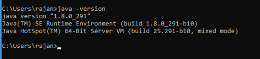
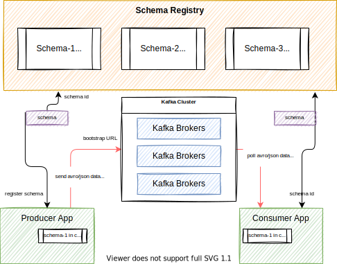
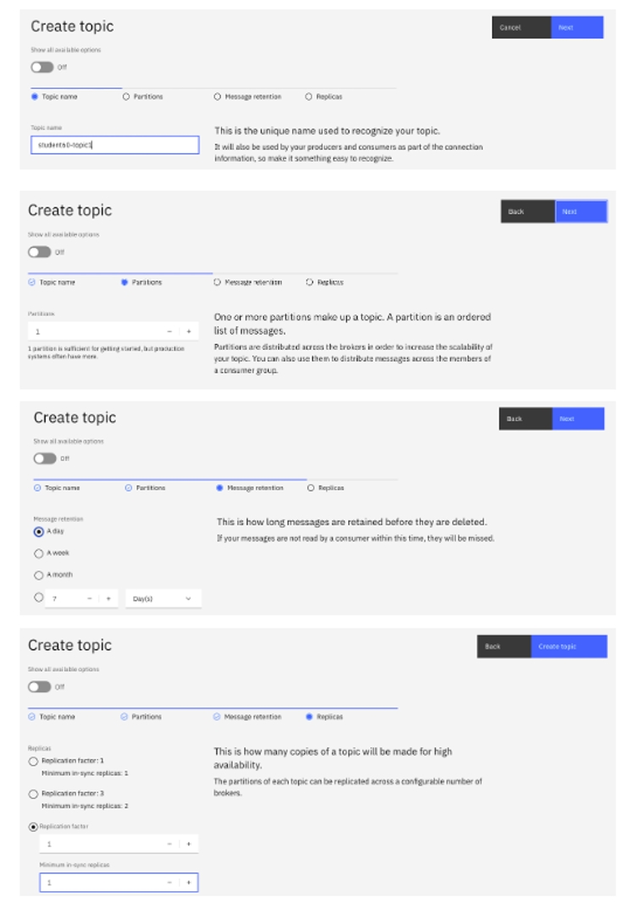
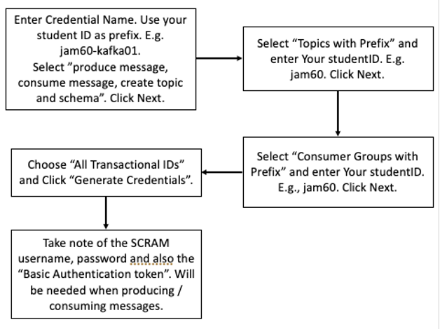
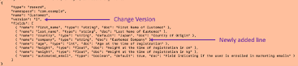
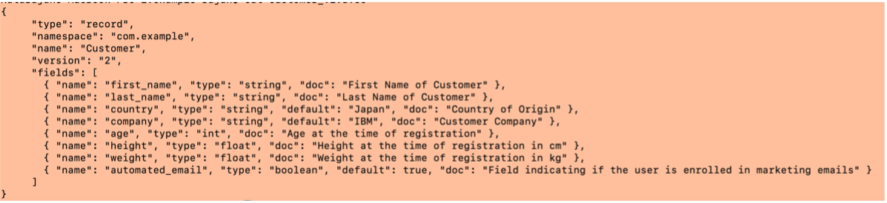

# Producing & Consuming Data with Event Streams and Schema

## Introduction

Version control can be a nightmare for organizations. With Kafka, it’s no different. With stream processing pipelines, there are no files to act as containers for messages with a single format. Let take a look at how Event Streams handles Schema Management with the Schema Registry.

## Lab Objective

In this lab, we’ll do the following: 

* Create a topic and attach a schema to it
* Create a Kafka User with appropriate rights to produce and consume data
* Gather information needed to connect to the Kafka cluster and Schema registry.
* Test producing / consuming data.
* Make changes to the Schema and see the impact to producer/consumer.

The following figure illustrates the components involved in this lab:

{ width="1200" }

You will run producer and consumer apps on your laptop, and they will contact schema registry and brokers using SCRAM authentication and TLS encryption.
## Setting Up The Client Machine

Setting up the sample Kafka Client to be used for the lab.

This section provides the instructions for setting up the Kafka Client that will be used throughout the labs.

1. Check java install

    

    ```sh
    C:\Users\rajan>java -version
    At least version 1.8.0_301 should be available.
    ```

	If it’s not installed, download and install the Java Runtime. Use the [adoptium site to download Java](https://adoptium.net/)

2.	Download the sample Kafka Client code [from here:](https://github.com/ibm-cloud-architecture/eda-tech-academy/blob/main/tech-jam/KafkaClient_20220131.zip) to be used on your local laptop.

3.	Unzip the downloaded Kafka Client (KafkaClient_YYYYMMDD.zip) into a folder: 

    ```sh
    C:\TechJam\EventStreams_Lab\
    unzip KafkaClient_20220131.zip 
    ```

4.	Test the client: Open a Command Prompt.

    ```sh
    cd C:\TechJam\EventStreams_Lab\KafkaClient_YYYYMMDD\
	java -jar KafkaClient.jar
    ```

{ width="1200" }


## Pre-Requisites

* Have setup the client machine properly. 
* Able to access the Event Streams web interface. 

## Understanding Schema Registry

### What is a Schema Registry?

Schema Registry provides a serving layer for your metadata. It provides a RESTful interface for storing and retrieving your Avro®, JSON Schema, and Protobuf schemas. 

* It stores a versioned history of all schemas based on a specified subject name strategy, provides multiple compatibility settings.
* Allows evolution of schemas according to the configured compatibility settings and expanded support for these schema types. 
* Provides serializers that plug into Apache Kafka® clients that handle schema storage and retrieval for Kafka messages that are sent in any of the supported formats.

In Event Streams, Schemas are stored in internal Kafka topics by the [Apicur.io Registry](http://apicur.io/registry), an open-source schema registry led by Red Hat. In addition to storing a versioned history of schemas, Apicurio Registry provides an interface for retrieving them. Each Event Streams cluster has its own instance of Apicurio Registry providing schema registry functionality.

 
{ width="1200" }


### How the Schema Registry Works?

Now, let’s take a look at how the Schema Registry works.

1.	Sending applications request schema from the Schema Registry.
2.	The scheme is used to automatically validates and serializes be for the data is sent.
3.	Data is sent, serializing makes transmission more efficient. 
4.	The receiving application receives the serialized data.
5.	Receiving application request the schema from the Schema Registry. 
6.	Receiving application deserializes the same data automatically as it receives the message.  


## Lab Procedures


### Creating a topic and attaching a schema to it

1. Click on one of the links below (depending on the OpenShift cluster allocated to you) to log into your Event Streams instance using the student credentials provided. Once you've logged in, you'll see the Event Streams homepage.


    | Host | URL |
    | --- | --- |
    | Finn | [https://cpd-cp4i.apps.finn.coc-ibm.com/integration/kafka-clusters/cp4i-eventstreams/es-demo/gettingstarted](https://cpd-cp4i.apps.finn.coc-ibm.com/integration/kafka-clusters/cp4i-eventstreams/es-demo/gettingstarted) |
    | Cody| [https://cpd-cp4i.apps.cody.coc-ibm.com/integration/kafka-clusters/cp4i-eventstreams/es-demo/gettingstarted](https://cpd-cp4i.apps.cody.coc-ibm.com/integration/kafka-clusters/cp4i-eventstreams/es-demo/gettingstarted) |
    | Grievous | [https://cpd-cp4i.apps.grievous.coc-ibm.com/integration/kafka-clusters/cp4i-eventstreams/es-demo/gettingstarted](https://cpd-cp4i.apps.grievous.coc-ibm.com/integration/kafka-clusters/cp4i-eventstreams/es-demo/gettingstarted) |  

    

1. Create Topic.

    Click on Create a Topic. Use only lower cases for the topic name (e.g. `finn20-customers`).

    { width="900" }

    Please refer to screenshots attached as sample. 

    { width="1200" }

1. Next create the schema and attach to the topic. 

    * Click on the Schema Registry tab in the left. 

    { width="600" }

    * Click on Add Schema (in the right)

   { width="600" }

   * Click Upload Definition -> Choose `customer.avsc` located in the Kafka Client unzipped folder. (`C:\TechJam\EventStreams_Lab\KafkaClient_YYYYMMDD\com\example`)
   
    { width="1200" }

    * Check the details and make sure the schema is valid. 
    * **Change the name of the schema** to avoid conflict with other students: The name of the schema maps the schema to the topic. To attach this schema to your topic, the schema should be named according to the topic: <topic_name>-value. (For example, if your topic is `finn20-customers`”, the schema should be named)
 
    { width="1200" }

    Click on Add Schema. The schema is now attached to the topic. 

## Creating a Kafka User with appropriate rights.




1.	Go to the Event Streams home page. **Select** “Connect to this Cluster” -> Generate SCRAM Credentials.
 
    { width="1200" }

    Refer to the screenshot attached as reference. 

 
    { width="1300" }

    Keep information about the SCRAM password. 
## Gather Connection Details

Creating connection from Consumer / Producer requires some connectivity details. These details can be gathered from the Event Stream’s portal. Connectivity details needed will depend on type of authentication and SASL mechanism used. 

From the Event Stream home page, click on “Connect to this Cluster”.  Get the following information from the page. Refer to screenshot below on how to get these.

1. Bootstrap URL
1. Truststore Certificate File. Copy the downloaded file to the Kafka Client folder.
1. Truststore Password. (Password will be generated once Download Certificate is clicked).
1. Schema Registry URL

{ width="1200" }

## Test Producer / Consumer

1.	Prepare the `config.properties` file located in `C:\TechJam\EventStreams_Lab\KafkaClient_YYYYMMDD\` Check and change the following fields. The fields not mentioned here can be left default. 

    | Field	| Value |
    | --- | --- |
    |enableschemaavro	| True (as we have schema attached to the topic) |
    | bootstrap.servers	| Enter the URL obtained in previous section e.g. es1-kafka-bootstrap-cp4i.apps.ocp46.tec.uk.ibm.com:443 |
    | sasl.jaas.config	| Paste this string. Replace the Username and Password.  org.apache.kafka.common.security.scram.ScramLoginModule required username='<SCRAM_USER>' password='<SCRAM_PASSWORD>'; |
    | sasl.mechanism	| SCRAM-SHA-512 |
    | security.protocol	 |SASL_SSL |
    | topic	| Topic created previously. E.g. jam60-topic1 |
    | group.id	| Enter a Consumer Group ID. You can enter a Consumer Group. Remember that it should have a prefix of your studentID. E.g. jam60-consumer-group-v1 |
    | ssl.truststore.location | Should point to the Truststore certificate downloaded. Example:  ./es-cert.p12 |
    | ssl.truststore.password | Enter the Truststore password obtained. |
    | schema.registry.url | Enter the URL obtained in previous section e.g. https://es1-ibm-es-ac-reg-external-cp4i.apps.ocp46.tec.uk.ibm.com |
    | schema.registry.basic.auth.user.info |	<SCRAM_USER\>:<SCRAM_PASSEORD\> |
    | schema.registry.ssl.truststore.location	| Same as ssl.truststore.location |
    | schema.registry.ssl.truststore.password | 	Same as ssl.truststore.password |


    This is how your `config.properties` should look like after the changes. This is a sample. Do not copy and paste this contents. 

    ```sh
    ## Mandatory Section ##
    # Set to true if avro schema is enabled for the topic
    enableschemaavro = true
    # Set to true if want to enable Intercept Monitoring.
    enableintercept = false
    # Set this to true if mTLS (2-way authentication) is enabled.
    enablemtls = false
    # Confluent Broker related properties
    bootstrap.servers = minimal-prod-kafka-bootstrap-es.mycluster-rajan09-992844b4e64c83c3dbd5e7b5e2da5328-0000.sng01.containers.appdomain.cloud:443
    sasl.jaas.config = org.apache.kafka.common.security.scram.ScramLoginModule required username='jam60-kafka01' password='Do0vIJuwnANZ';
    # Options are PLAIN, SCRAM, GSSAPI
    sasl.mechanism=SCRAM-SHA-512
    # Options are SSL, PLAINTEXT, SASL_SSL, SASL_PLAINTEXT
    security.protocol=SASL_SSL
    topic=jam60-topic1
    #topic=UserDatabase
    # Consumer Group ID
    group.id = jam60-student-group-v1 
    client.id = student-client-v1
    #--------------------------------
    ## To be filled in if TLS is enabled for the Brokers
    # Options are PKCS12, JKS, PEM. Password not required for PEM.
    ssl.truststore.type=PKCS12
    ssl.truststore.location=./es-cert.p12
    ssl.truststore.password=muuJr3QFiiwa
    #--------------------------------
    ## To be filled if mTLS (Mutual TLS) is enabled in Brokers
    ssl.keystore.location=/home/rajan/load_security/kafka.client.keystore.jks
    ssl.keystore.password=clientpass
    ssl.key.password=clientpass
    #-------------------------------
    ## To be filled in if Schema is enabled
    schema.registry.url = https://minimal-prod-ibm-es-ac-reg-external-es.mycluster-rajan09-992844b4e64c83c3dbd5e7b5e2da5328-0000.sng01.containers.appdomain.cloud
    # The following parameter MUST be set to false if connecting to EventStreams (APICURIO Schema).
    auto.register.schemas=true
    ## To be filled in if Schema Registry requires Authentication (e.g. with RBAC enabled). Otherwise leave it as default.
    basic.auth.credentials.source = USER_INFO
    schema.registry.basic.auth.user.info = jam60-kafka01:Do0vIJuwnANZ
    #--------------------------------
    ## To be filled in if TLS is enabled for Schema Registry
    schema.registry.ssl.truststore.location=./es-cert.p12
    schema.registry.ssl.truststore.password=muuJr3QFiiwa
    #--------------------------------
    ## To be filled if Consumer / Producer Intercept should be turned on
    intercept_bootstrapServers = es3minimal-kafka-bootstrap-es3.mycluster-rajan07-992844b4e64c83c3dbd5e7b5e2da5328-0000.jp-tok.containers.appdomain.cloud:443
    intercept_sasljaas = org.apache.kafka.common.security.scram.ScramLoginModule required username='rajan' password='CfKQZG9Cm7g5';
    intercept_security = SASL_SSL
    intercept_saslmechanism = SCRAM-SHA-512
    #--------------------------------
    ## To be used when Kerberos Authentication is used
    sasl.kerberos.service.name=kafka
    #--------------------------------
    ## Required parameters if Confluent in Confluent Cloud is used
    retries = 2
    ```

1. Test producing message. 

    Go to this folder in command prompt:
    
    ```sh
    cd C:\TechJam\EventStreams_Lab\KafkaClient_YYYYMMDD\ 
    java -jar KafkaClient.jar producer 10 config.properties
    ```

    Check if the message is listed in the topic. In the Event Streams portal, go to Topics. Look for the topic that you created. Click on it. Then click on messages.  You should see the messages produced. 

    !!! Warning
        The messages content may not be displayed correctly in the portal due to binary serialization with Avro.
    
    { width="1200" }

1. Test consuming message. 

    ```sh
    java -jar KafkaClient.jar consumer config.properties
    ```

    Messages should be consumed correctly.  Message content should be displayed correctly. Press CTRL-C to stop the consumer. 

  
    { width="1200" }


## Check the impact of changing the Schema Registry

1. We will change the schema registry by adding a new field with default value, and check what happens when producing / consuming. 

    In the client computer, make a copy of the customer.avsc file (located in `C:\TechJam\EventStreams_Lab\KafkaClient_YYYYMMDD\com\example>`) and name it `customer_v2.avsc`. You can do this from Windows Explorer.

    Edit the file using Notepad++. Add this line right after country. Change the version to version `1.1`.
    
    ```json
       { "name": "company", "type": "string", "doc": "Customer Company"},
    ```

    The `customer_v2.avsc` should look like this:

    { width="1000" }

    { width="1200" }

1. From the Event Streams portal, Go to Schema Registry -> Click on your Schema. Then, click on “Add New Version”.

1. Click on “Upload Definition” and select the edited avsc file (`customer_v2.avsc`).

    { width="1200" }

    You should get a validation failed message. 

1.	Understanding Schema Registry Evolution

    When a schema is created, it has to have a compatibility mode. The most used compatibility modes are:

    * BACKWARD - new schema can be used to read data written with old schema [e.g. consumer uses the new schema and read an older offset data]
    * FORWARD - old schema can still be used (e.g. by consumers) to read data written in new schema
    * FULL - Both forward and backward

    In Event Streams, the default compatibility mode is FULL. 

    In our `customer_v2.avsc` we have added a new mandatory field. Older consumers may not be aware of this field until they update their code. Hence, our schema is NOT FORWARD compatible and so, it fails validation. 

1.	Now, edit the schema file (customer_v2.avsc) again and add a default value to the newly added line. The line should look like this:


    ```json
    { "name": "company", "type": "string", "default": "IBM", "doc": "Customer Company" },
    ```

    The `customer_v2.avsc` should look like this.

    

1.	Now try updating the schema. Validation should pass. Change the version number and click on “Add Schema”. 

## Test producing / consuming data

1. Getting details about the schema. 

    The Event Streams schema registry supports a Rest Endpoint that provides details about the schema. 

    First make sure you have the Basic Authentication Token created during the process of creating the Kafka SCRAM User. If you missed copying the token, you can generate the token from the SCRAM USERNAME and SCRAM PASSWORD. 

    Open this URL: [https://www.base64encode.org/](https://www.base64encode.org/)
Enter your SCRAM USERNAME and SCRAM PASSWORD separated by a colon.
E.g. <SCRAM_USER>:<SCRAM_PASSEORD>
Click on Encode and it will generate the Basic Authentication Token. 

Get the default compatibility. 

```sh
curl -ki -X GET -H "Accept: application/json" -H "Authorization: Basic <BASIC AUTH TOKEN>" https://<SCHEMA_REGISTRY_URL>/rules/COMPATIBILITY
E.g. 
curl -ki -X GET -H "Accept: application/json" -H "Authorization: Basic <BASIC_AUTH_TOKEN>" https://es1-ibm-es-ac-reg-external-cp4i.apps.ocp46.tec.uk.ibm.com/rules/COMPATIBILITY
```

The response should be something like:

```json
{"config":"FULL","type":"COMPATIBILITY"}
````

This shows that the default compatibility is FULL.

Next get the compatibility of the specific schema that we are using. 

```sh
curl -ki -X GET -H “Accept: application/json” -H “Authorization: Basic <BASIC_AUTH_TOKEN>” https://es1-ibm-es-ac-reg-external-cp4i.apps.ocp46.tec.uk.ibm.com/artifacts/<YOUR_SCHEMA_NAME>/rules
```

This should give you an empty response 

```json
[]
```

Which basically means – the schema uses the default global setting – which is FULL (as we saw when we tried changing the schema).
 
* Test sending some message, you will see default value for the company new field.

```sh
java -jar KafkaClient.jar producer 10 config.properties
```

!!! success "Congratulations!" You've completed the schema registry lab. 

[>> Next - Event End Point Management](./eepm.md)