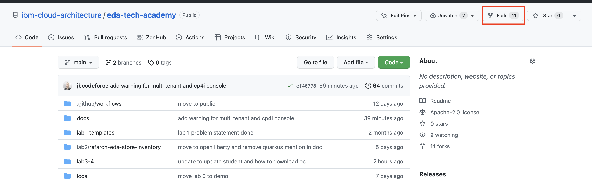

# Event-driven solution - Tech Academy Workshop

The general objective of this academy training is to develop deeper technical skills, within the IBM technical community, to plan, design, build and execute a sub-set of key Proof Of Concept tasks and activities.

In this Event-driven solution workshop, you will learn how to use of Event-Driven/Near Real-time Integration Patterns, Technologies and Implementation Strategies which should help you developing simple Streaming 
applications and proof of concepts. 

## Two possible journeys

We recognize that not every student will have the same level of knowledge of Event Streams and integration capability or even Java development background. We propose two different tracks depending of your current skill level:

1. **Beginner journey**: do the demonstration lab, which is about being confortable to demonstrate Event Streams from "A to Z": this is a good 3 hours run thru exercise that will give you access to a lot of content you should be able to leverage overtime. You may also do the lab 1 as this is a system design mockup exercise, that should help you in the future. [Go to **Track 1** - demonstration lab >>](./demo/)

1. **Advance journey**: Perform labs 1 to 4, this is about learning Kafka Stream, Open Liberty application, using Configuration as Code for OpenShift deployment and GitOps approach. A full story and a set of reusable assets you may want to reuse to build you future proof of concepts. You can also review quickly the demonstration lab, as it could be helpful, as a script to answer specific customer's questions.  [Continue to the goals section below >>](#advance-journey-goals)

## Advance Journey Goals:

* Solidify a full body of knowledge in the near real-time / event driven architecture domain 
* Design and create an initial prototype solution that addresses the DOU goals and objectives.
* Establish an initial point of view for adopting GitOps methods and practices for event streams implementations.
* Give you foundational knowledge to deeply address event-driven solution design 
## Pre-requisites

* Have a [git client installed](https://github.com/git-guides/install-git)
* Have a git account into [IBM Internal github](https://github.ibm.com/) or public [github](https://github.com).
* Get [docker desktop](https://www.docker.com/products/docker-desktop/) or [podman](https://podman.io/) on your local laptop
* A JDK 11.
* Install the make tool:

    * For Mac: `brew install make`
    * For Windows: See [this note](https://www.technewstoday.com/install-and-use-make-in-windows/)

* Have [oc cli](https://docs.openshift.com/container-platform/4.7/cli_reference/openshift_cli/getting-started-cli.html) installed.
* Get a Java development IDE, we use [Visual Code](https://code.visualstudio.com/)
* Install [Java Coding Pack for Visual Studio](https://aka.ms/vscode-java-installer-win). This will download JDK and the necessary plugins.
* OCP access with CP4I installed, could be ROKS, TechZone with CP4I cluster, we are using [CoC environment](https://cmc.coc-ibm.com/cluster) as a base for our deployments.

**Fork** this repository to your own git account so you can modify content and deploy code from your repository when using GitOps.



and then clone it to your local laptop:

```sh
git clone ...
```

### Environments

We have two OpenShift clusters available with 25 userids each.

* [Poe cluster is console-openshift-console.apps.poe.coc-ibm.com](https://console-openshift-console.apps.poe.coc-ibm.com/dashboards)
* [Ahsoka cluster is console-openshift-console.apps.ahsoka.coc-ibm.com](https://console-openshift-console.apps.ahsoka.coc-ibm.com/dashboards)

* Userids will be poe1 to poe25 for Poe cluster
* Userids will be ahsoka1 to ahsoka25 for the Ahsoka cluster. 

### Mac user

All the scripts and configurations were developed from a Mac so no problem for you.

### Windows user

Need to enable Windows Subsystem for Linux.

1. Open a PowerShell screen and run this command.

    ```sh
    Enable-WindowsOptionalFeature -Online -FeatureName Microsoft-Windows-Subsystem-Linux
    ```

    This step will require a Reboot of the machine. Proceed to reboot.

1. Enable Virtual Machine Feature

    ```sh
    dism.exe /online /enable-feature /featurename:VirtualMachinePlatform /all /norestart
    ```

1. Download and install the Linux kernel update package [https://wslstorestorage.blob.core.windows.net/wslblob/wsl_update_x64.msi](https://wslstorestorage.blob.core.windows.net/wslblob/wsl_update_x64.msi)

1. Download and install Ubuntu Linux distribution from Microsoft Store. https://aka.ms/wslstore. Search for Ubuntu and click on ‘Get’. This will download and install Ubuntu terminal environment with WSL. Once installed Click on ‘Open’.

    The first time, it will take some time to decompress some files. Wait for this step to complete. At the end, you’ll be asked to create a username and password to be used to login. Finally, you will be in the Linux shell prompt.

1. Subsequently, open a CMD (or PowerShell) terminal and enter ‘bash’ to get access to the Linux shell.

1. Setup a few tools in the Ubuntu system. Run these in the Shell screen of Ubuntu.

    1. Install dos2unix.

        ```sh
        sudo apt-get update
        sudo apt-get install dos2unix
        ```

    1. Install ‘oc’ CLI. Download and extract the tool. 
    
        ```sh
        wget https://downloads-openshift-console.apps.cody.coc-ibm.com/amd64/linux/oc.tar --no-check-certificate
        tar -xvf oc.tar
        mv oc /usr/local/bin
        ```

    1. Install ‘make’

        ```sh
        sudo apt install make
        ```

    1. Install ‘zsh’ shell

        ```sh
        sudo apt install zs
        ```

## Study [Optional] - Lecture: Review key EDA patterns, use cases and usage scenarios.

* **Duration:** 20 minutes.
* **Delivery**: presenter will go over some concepts and presentation of the material. Can be self space study.

What are the technical use cases where Event Streams is a good fit. Why customers are going full speed to adopt EDA?

* [Technical use cases - general positioning](https://ibm-cloud-architecture.github.io/refarch-eda/introduction/usecases/#technical-use-cases)
* [Assessment questions for Event Streams opportunity](https://pages.github.ibm.com/boyerje/eda-internal/kafka-assessment/)
* Detailed [use case slides](https://github.ibm.com/boyerje/eda-internal/raw/master/docs/eda-usecases/01-EDA-Usecases.pptx)
* Review the subjects and content of the [end to end Event Streams Demo script](https://pages.github.ibm.com/boyerje/eda-internal/) just to get familiar.


???- "Read more"
    * [EDA internal site - use cases](https://pages.github.ibm.com/boyerje/eda-internal/eda-usecases/)
    * [EDA public web site we use to present content to customers](https://ibm.biz/learn-eda)
## Lab 1: System design for a real-time inventory solution

* **Duration**: 30 minutes
* **Delivery:** Can be done with 2 or 3 students and self pace.

Review the Client provided requirements, and elaborate a system design for an EDA solution.

* [Review the problem statement and the lab's instructions](./lab1/)
* [A potential solution may look like](./lab1/lab1-sol.md)

???- "Read more"
    * [Demonstration of Event Streams product](https://pages.github.ibm.com/boyerje/eda-internal/demo/demo-script/)
## Lab 2: Implement a simple item sell or restock event stream processing with Kafka Streams API

Learning the basic of Kafka Streams, and implement a store aggregation processing with Java. The code and environment should be self efficient. 

* **Optional**: if you really hate programming you can skip this lab, or at least read the first few exercices so you can understand some of the streaming concepts.
* **Duration**: 90 minutes
* **Delivery**: Pair programming.

* [Lab's instructions](./lab2) includes a set of progressing exercise to learn basic Kafka Streams programming.
* [Last exercise solution](./lab2/lab2-sol.md)
## Lab 3: Deploy the real time inventory solution in one Click

**Duration**: 20 minutes

This is a simple of the end to end solution, you will be able to deploy in few commands. It is also important to review some deployment definition content:

[20 minutes lab](./lab3)

## Lab 4: Deploy the solution with OpenShift GitOps

**Duration**: 30 minutes

In this lab, you will deploy the ArgoCD applications that monitor your git repository for any change to the configuration
and deploy the different services and MQ broker in your own namespace.

[Lab 4 GitOps deployment](./lab4)