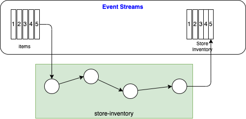
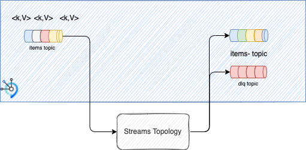

# Lab 2: Store inventory with Kafka Streams

In this Lab, you will learn simple Kafka Streams exercises using Java APIs, and then finish by implementing on of the proof of concept component to compute the store inventory for each items sold.

## Pre-requisites

This lab is about some Java implementation, if you have no experience in Java you may skip it. 

* Be sure your IDE, like VScode has java extension. For VSCode you can use [Quarkus extension](https://marketplace.visualstudio.com/items?itemName=redhat.vscode-quarkus) and [Red Hat java extension](https://marketplace.visualstudio.com/items?itemName=redhat.java)
* maven is used to package and run some test. The project has `./mvnw` command that brings maven in the project.

## Context

The figure illustrates what you need to build, the green rectangle, which is a [Java Quarkus](https://quarkus.io) application using Kafka Streams API consuming `items` events and computing `store inventory` events by aggregating at the store level.



In fact, most of the code is already done for you, and the lab is to help you building event streaming knowledge by increment. At the end of this training you should be able to reuse this approach in your future work. All the development is done by running on your local computer, not need to deploy to OpenShift.

In the global view of the real-time inventory solution presented in the lab 1, the goal is to do the store aggregation processing.
## Step by step exercises

Before implementing the store inventory, you need to learn Kafka streams programming with a set of simple exercises. 

Review the  [Kafka Streams API concepts and basic APIs here](./kstream/).

To do the hands-on exerices, go to the `/lab2/refarch-eda-store-inventory` folder of this repository, load this folder into your IDE. Be sure you can run tests inside the IDE, it may be easier to debug.


### Exercise 1: Test your first topology

**Duration: 10 minutes**

**Goal:** Test a basic topology inside unit test.

In your IDE go to the `src/test/java/ut` folder and open the class: [TestYourFirstTopology.java](https://github.ibm.com/boyerje/eda-tech-academy/blob/main/lab2/refarch-eda-store-inventory/src/test/java/ut/TestYourFirstTopology.java "Link to apache doc"). The most important elements of this test are:

* The `TopologyTestDriver` is a class to test a Kafka Streams topology without Kafka. It uses dummy configuration.
* the `TestInputTopic` class is used to pipe test records to a topic in TopologyTestDriver. This is used to send test messages. The creation of this instance needs to specify the serializer or deserialer used.
* The `@BeforeAll` annotation on the `setup()` method means that it will be run before any test is executed, while the `@AfterAll` annotation on the teardown method ensures that it will be run after last test execution.  We use this approach to define the topology under test in this class.

```Java title="Build test driver and topics"
import org.apache.kafka.streams.StreamsConfig;
import org.apache.kafka.streams.TestInputTopic;
import org.apache.kafka.streams.TestOutputTopic;
import org.apache.kafka.streams.TopologyTestDriver;
import org.apache.kafka.common.serialization.StringDeserializer;
import org.apache.kafka.common.serialization.StringSerializer;
//...
Topology topology = buildTopologyFlow();
testDriver = new TopologyTestDriver(topology, getStreamsConfig());
inTopic = testDriver.createInputTopic(inTopicName, new StringSerializer(), new StringSerializer());
outTopic = testDriver.createOutputTopic(outTopicName, new StringDeserializer(), new StringDeserializer()); 
```

* The `buildTopology` method utilizes the `StreamsBuilder` class to construct a simple Kafka Streams topology, reading from the input Kafka topic defined by the inTopicName String. The logic is simply to print the message, the filter on a `blue` value, and generates the output to a topic:

```java title="buildTopology(): Filter text message topology"
KStream<String, String> basicColors = builder.stream(inTopicName,Consumed.with(Serdes.String(), Serdes.String()));
basicColors.peek((key, value) -> System.out.println("PRE-FILTER: key=" + key + ", value=" + value)) // (1)
    .filter((key, value) -> ("BLUE".equalsIgnoreCase(value))) // (2)
    .peek((key, value) -> System.out.println("POST-FILTER: key=" + key + ", value=" + value))
    .to(outTopicName); // (3)
```

1. `Peek()` to get the message, apply a lambda function and do nothing else. Used for printing
1. `filter()` to select records. So here there is a transformation of the input kstream and output kstream
1. `to()` is to output the stream to a topic.


Run this test you should see the following output: The first part is a print of the defined topology and then the execution of the topology on the different input records.

```sh
Topologies:
   Sub-topology: 0
    Source: KSTREAM-SOURCE-0000000000 (topics: [my-input-topic])
      --> KSTREAM-PEEK-0000000001
    Processor: KSTREAM-PEEK-0000000001 (stores: [])
      --> KSTREAM-FILTER-0000000002
      <-- KSTREAM-SOURCE-0000000000
    Processor: KSTREAM-FILTER-0000000002 (stores: [])
      --> KSTREAM-PEEK-0000000003
      <-- KSTREAM-PEEK-0000000001
    Processor: KSTREAM-PEEK-0000000003 (stores: [])
      --> KSTREAM-SINK-0000000004
      <-- KSTREAM-FILTER-0000000002
    Sink: KSTREAM-SINK-0000000004 (topic: my-output-topic)
      <-- KSTREAM-PEEK-0000000003

[or.ap.ka.st.pr.in.StreamTask] (main) stream-thread [main] task [0_0] Initialized
[or.ap.ka.st.pr.in.StreamTask] (main) stream-thread [main] task [0_0] Restored and ready to run
PRE-FILTER: key=C01, value=blue
POST-FILTER: key=C01, value=blue
PRE-FILTER: key=C02, value=red
PRE-FILTER: key=C03, value=green
PRE-FILTER: key=C04, value=Blue
POST-FILTER: key=C04, value=Blue
PRE-FILTER: key=C01, value=blue
POST-FILTER: key=C01, value=blue
[or.ap.ka.st.pr.in.StreamTask] (main) stream-thread [main] task [0_0] Suspended running
[or.ap.ka.st.pr.in.RecordCollectorImpl] (main) topology-test-driver Closing record collector clean
[or.ap.ka.st.pr.in.StreamTask] (main) stream-thread [main] task [0_0] Closed clean
```

See comments in test class for more information. May be you can play with the data, and change the filter condition. 
### Exercise 2: Filter item transaction without a store

**Problem:** Given item sold transactions, keep transactions with store and sku information populated.

Try to do a topology taking the [ItemTransaction class](https://github.ibm.com/boyerje/eda-tech-academy/blob/main/lab2/refarch-eda-store-inventory/src/main/java/ibm/gse/eda/stores/domain/ItemTransaction.java) as the code defining the content from the input topic. The following code does not need to be copied/paste. It is here to explain you the structure of the data. The class is in the classpath, so tests run in maven or in the IDE will work.

```java
public class ItemTransaction   {
        public static String RESTOCK = "RESTOCK";
        public static String SALE = "SALE";
        public Long id;
        public String storeName;
        public String sku;
        public int quantity;
        public String type;
        public Double price;
        public String timestamp;
```

So the Stream Topology needs to use the `filter()` function to select items with valid sku and storeName.

You should use the [TestSecondTopology test class](https://github.ibm.com/boyerje/eda-tech-academy/blob/main/lab2/refarch-eda-store-inventory/src/test/java/ut/TestSecondTopology.java), and implement the Kafka Streams topology in the `buildTopologyFlow()` method:

```java title="Build filtering"
   public static Topology buildTopologyFlow(){
        final StreamsBuilder builder = new StreamsBuilder();
         // 1- get the input stream

        // 2 filter

        // Generate to output topic

        return builder.build();  
    }
```

In the first exercice, we used String Deserializer. This time we need Java Bean serializer/deserializer. This is a classical task in any Kafka Streams projects to have to define such serdes.
The Serialization and Deserialization are defined in the [StoreSerdes.class](https://github.ibm.com/boyerje/eda-tech-academy/blob/main/lab2/refarch-eda-store-inventory/src/main/java/ibm/gse/eda/stores/infra/events/StoreSerdes.java) which uses a [JSON generic class](https://github.ibm.com/boyerje/eda-tech-academy/blob/main/lab2/refarch-eda-store-inventory/src/main/java/ibm/gse/eda/stores/infra/events/JSONSerde.java) based on Jackson parser. You should be able to reuse this class in all your project.

Do not copy / past the following code. This is just for information so you can see the relationship between Serdes and the Java bean they are supposed to deserialize.

```java title="JSONSerdes"
import org.apache.kafka.common.serialization.Deserializer;
import org.apache.kafka.common.serialization.Serde;
import org.apache.kafka.common.serialization.Serializer;
public class JSONSerde<T> implements Serializer<T>, Deserializer<T>, Serde<T> {
    private static final ObjectMapper OBJECT_MAPPER = new ObjectMapper();
    private String className;

    public JSONSerde(String cn){
        this.className = cn;
    }
    //..
```

An example of specific usage for this class is the [StoreSerdes](https://github.ibm.com/boyerje/eda-tech-academy/blob/main/lab2/refarch-eda-store-inventory/src/main/java/ibm/gse/eda/stores/infra/events/StoreSerdes.java) class.

```java
public class StoreSerdes {
    
    public static Serde<ItemTransaction> ItemTransactionSerde() {
        return new JSONSerde<ItemTransaction>(ItemTransaction.class.getCanonicalName());
    }
    // ..
}
```

Using the StoreSerdes, the test topic declarations in the TestCase class, are using the serdes like:


```java title="setup method"
// Key of the record is a String, value is a ItemTransaction 
inputTopic = testDriver.createInputTopic(inTopicName, 
        new StringSerializer(), 
        StoreSerdes.ItemTransactionSerde().serializer()); 
outputTopic = testDriver.createOutputTopic(outTopicName, 
        new StringDeserializer(),  
        StoreSerdes.ItemTransactionSerde().deserializer());
```

Now some guidances of what the Stream topology should look like:

* Think to build a Kstream from the input stream
* The record should have key and value
* use filter and predicate to test if value.storeName has no value or value.sku is empty or null then drop the message
* generate output to a topic
* Think to chain the functions to get accurate result

Use Test Driven Development to build tests before the topology, but here tests are already defined for you.

```java title="Happy Path Test"
    @Test
    public void sendValidRecord(){
        ItemTransaction item = new ItemTransaction("Store-1","Item-1",ItemTransaction.RESTOCK,5,33.2);
        inputTopic.pipeInput(item.storeName, item);
        assertThat(outputTopic.getQueueSize(), equalTo(1L) );
        ItemTransaction filteredItem = outputTopic.readValue();
        assertThat(filteredItem.storeName, equalTo("Store-1"));
        assertThat(filteredItem.sku, equalTo("Item-1"));
    }
```

* Here is a typical trace: the id of the transaction is a timestamp as long, so those values will change.

```java title="Expected execution trace"
Topologies:
   Sub-topology: 0
    Source: KSTREAM-SOURCE-0000000000 (topics: [my-input-topic])
      --> KSTREAM-PEEK-0000000001
    Processor: KSTREAM-PEEK-0000000001 (stores: [])
      --> KSTREAM-FILTER-0000000002
      <-- KSTREAM-SOURCE-0000000000
    Processor: KSTREAM-FILTER-0000000002 (stores: [])
      --> KSTREAM-PEEK-0000000003
      <-- KSTREAM-PEEK-0000000001
    Processor: KSTREAM-PEEK-0000000003 (stores: [])
      --> KSTREAM-SINK-0000000004
      <-- KSTREAM-FILTER-0000000002
    Sink: KSTREAM-SINK-0000000004 (topic: my-output-topic)
      <-- KSTREAM-PEEK-0000000003

....
PRE-FILTER: key=Store-1, value= {id: 1653431482009 Store: Store-1 Item: null Type: RESTOCK Quantity: 5}
PRE-FILTER: key=Store-1, value= {id: 1653431482107 Store: Store-1 Item: Item-1 Type: RESTOCK Quantity: 5}
POST-FILTER: key=Store-1, value= {id: 1653431482107 Store: Store-1 Item: Item-1 Type: RESTOCK Quantity: 5}
PRE-FILTER: key=, value= {id: 1653431482114 Store:  Item: Item-1 Type: RESTOCK Quantity: 5}
PRE-FILTER: key=Store-1, value= {id: 1653431482116 Store: Store-1 Item:  Type: RESTOCK Quantity: 5}
PRE-FILTER: key=null, value= {id: 1653431482118 Store: null Item: Item-1 Type: RESTOCK Quantity: 5}
```

???- "Solution"
    The topology looks like
    ```java
    KStream<String,ItemTransaction> items = builder.stream(inTopicName, 
         Consumed.with(Serdes.String(),  StoreSerdes.ItemTransactionSerde()));  
        items.peek((key, value) -> System.out.println("PRE-FILTER: key=" + key + ", value= {" + value + "}"))
            .filter((k,v) -> 
                (v.storeName != null && ! v.storeName.isEmpty() && v.sku != null && ! v.sku.isEmpty())) 
            .peek((key, value) -> System.out.println("POST-FILTER: key=" + key + ", value= {" + value + "}"))
            .to(outTopicName);
    ```

### Exercise 3: Dead letter topic

**Problem:** from the previous example, we would like to route the messages with errors to a dead letter topic, for future processing. May be a human intervention? The dead letter topic is a classical integration pattern, and when dealing with Kafka and streaming it looks like:




Transform the previous topology to support branches and routing the records in error to a dead letter topic. 

You should use the [TestDeadLetterTopic](https://github.ibm.com/boyerje/eda-tech-academy/blob/main/lab2/refarch-eda-store-inventory/src/test/java/ut/TestDeadLetterTopic.java) test class, and implement the Kafka Streams topology in the buildTopologyFlow() method:

Some guidances:

* Define a dead letter topic
* Create a [StreamsBuilder]: Builder for Kafka Streams topology
* Create a KStream with key as string and value as ItemTransaction
* Use the concept of [branches](./kstream/#kstream-api) by splitting the input stream
* Use lambda function for testing condition on `sku` and `storeName` attributes
* Output the branches to topics

???- "Solution"
    * Dead letter topic declaration
    ```java
    private  static TestOutputTopic<String, ItemTransaction> dlTopic;
    private static String deadLetterTopicName = "dl-topic";
    ```
    * Define topology
    ```java
    final StreamsBuilder builder = new StreamsBuilder();
        // 1- get the input stream
    KStream<String,ItemTransaction> items = builder.stream(inTopicName, 
            Consumed.with(Serdes.String(),  StoreSerdes.ItemTransactionSerde()));  
    // 2 build branches
    Map<String, KStream<String,ItemTransaction>> branches = items.split(Named.as("B-"))
    .branch((k,v) -> 
        (v.storeName == null ||  v.storeName.isEmpty() || v.sku == null || v.sku.isEmpty()),
        Branched.as("wrong-tx")
    ).defaultBranch(Branched.as("good-tx"));
    // Generate to output topic
    branches.get("B-good-tx").to(outTopicName);
    branches.get("B-wrong-tx").to(deadLetterTopicName);
    ```
    * Define output topic in setup()
    ```java
    dlTopic = testDriver.createOutputTopic(deadLetterTopicName, new StringDeserializer(),  StoreSerdes.ItemTransactionSerde().deserializer());
    ```

### Exercice 4 - Using Ktable

**Problem:** now you want to group record in table and keep last item transaction per store

**Input examples:**

```json
{"id":9,"price":30.0,"quantity":10,"sku":"Item_1","storeName":"Store_1","timestamp":"2022-05-19T16:22:37.287937","type":"RESTOCK"}

{"id":6,"price":10.0,"quantity":5,"sku":"Item_3","storeName":"Store_1","timestamp":"2022-05-12T23:13:31.338671","type":"SALE"}
```

Expected result in a Ktable - store:

```
Item_3
```

**Guidances**

* The input topic is keyed by the SKU so we need to rekey to store name: 

    ```java
        inputTopic.pipeInput(item.sku, item);
    ```

* Create a Kstream from the items stream
* use `map` to generate new KeyValue with key being the storeName
* Create a Ktable from the output of the map
* Use materialized view to keep data in a state store (KeyValueStore)

???- "Solution"
    * The topology looks like
    ```java
    KStream<String,ItemTransaction> items = builder.stream(inTopicName, 
        Consumed.with(Serdes.String(),  StoreSerdes.ItemTransactionSerde()));  
    KTable<String,ItemTransaction> lastItemInStore = items
                .map((k,v) -> { 
                    return new KeyValue<String,ItemTransaction>(v.storeName, v);
                }).toTable(
                        Materialized.<String, ItemTransaction, KeyValueStore<Bytes, byte[]>>as(storeName)
                .withKeySerde(Serdes.String()).withValueSerde( StoreSerdes.ItemTransactionSerde()));
    ```
    * The trace for the topology:
    ```
    Topologies:
    Sub-topology: 0
    Source: KSTREAM-SOURCE-0000000000 (topics: [my-input-topic])
      --> KSTREAM-MAP-0000000001
    Processor: KSTREAM-MAP-0000000001 (stores: [])
      --> KSTREAM-FILTER-0000000004
      <-- KSTREAM-SOURCE-0000000000
    Processor: KSTREAM-FILTER-0000000004 (stores: [])
      --> KSTREAM-SINK-0000000003
      <-- KSTREAM-MAP-0000000001
    Sink: KSTREAM-SINK-0000000003 (topic: KSTREAM-TOTABLE-0000000002-repartition)
      <-- KSTREAM-FILTER-0000000004

    Sub-topology: 1
    Source: KSTREAM-SOURCE-0000000005 (topics: [KSTREAM-TOTABLE-0000000002-repartition])
      --> KSTREAM-TOTABLE-0000000002
    Processor: KSTREAM-TOTABLE-0000000002 (stores: [ItemTable])
      --> none
      <-- KSTREAM-SOURCE-0000000005
    ```

### More examples

For your information here are some more test classes that demonstrate some streaming examples:

* [TestAccumulateItemSold](https://github.ibm.com/boyerje/eda-tech-academy/blob/main/lab2/refarch-eda-store-inventory/src/test/java/ut/TestAccumulateItemSold.java) to demonstrate counting item sold event per sku. It groups by sku, and then count and emit events. Without Ktable caching the sequence of output records is emitted for key that represent changes in the resulting aggregation table.

```java
    KStream<String,ItemTransaction> items = builder.stream(inTopicName, 
        Consumed.with(Serdes.String(),  StoreSerdes.ItemTransactionSerde())); 
        // 2- to compute aggregate we need to group records by key to create KGroupTable or stream
        // here we group the records by their current key into a KGroupedStream 
        KTable<String,Long> countedItems = items
        .filter((k,v) -> ItemTransaction.SALE.equals(v.type))
        .groupByKey()
        // 3- change the stream type from KGroupedStream<String, ItemTransaction> to KTable<String, Long>
        .count();
        
    // Generate to output topic
    countedItems.toStream().to(outTopicName);
```

* Same example as above but because of the caching to state store, the results are queriable. The test class is [TestAccumulateItemSoldWithCaching](https://github.ibm.com/boyerje/eda-tech-academy/blob/main/lab2/refarch-eda-store-inventory/src/test/java/ut/TestAccumulateItemSold.java)

## Final store inventory exercice

As decided during the system design, you need now to implement the proof of concept around streaming restock or sale transaction.
### Problem statement

How to get the real-time view of the inventory per store?

The [ItemTransaction.java](https://github.ibm.com/boyerje/eda-tech-academy/blob/main/lab2/refarch-eda-store-inventory/src/main/java/ibm/gse/eda/stores/domain/ItemTransaction.java) represents the message structure of the input topic. Below is an extract of this definition:


Here is an example of json message you may see in a topic:

```json
{"id":9,"price":30.0,"quantity":10,"sku":"Item_1","storeName":"Store_5","timestamp":"2022-05-19T16:22:37.287937","type":"RESTOCK"}

{"id":6,"price":10.0,"quantity":5,"sku":"Item_3","storeName":"Store_1","timestamp":"2022-05-12T23:13:31.338671","type":"SALE"}
```

We need to compute aggregate for each store level. For example the outcome may look like:

```json
{"storeName":"Store_1","stock":{"Item_3":20,"Item_2":0,"Item_1":20}}
```

Events could be RESTOCK or SALE. The `type` attribute defines this. `sku` represents the item identifier.

The input topic is `items` and the output topic is `store.inventory`. We assume ItemTransaction fields are all present, so the streaming logic does not need to assess data quality.

### Design questions

* What is the data model you need to use to keep store inventory?
* What event will be produced to the `store.inventory` topic?
* We need to process 5 million messages per day. Day is from 6:00 am to 10 pm every day.

???- "Some hints"
    * Define a New class to support keeping Store and a Map<String, Lon> for items and current stock value. This class will be the event structure to get to the output topic
    * Use a method to update the quantity of an existing inventory instance with a new retrieved event
    * Use [KStream aggregate function](./kstream/#kstream) to create new entry and update existing store entry

[Solution review and code explanation>>](./lab2-sol.md)