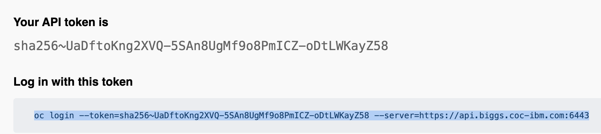
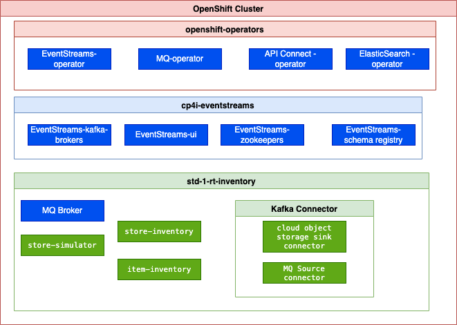
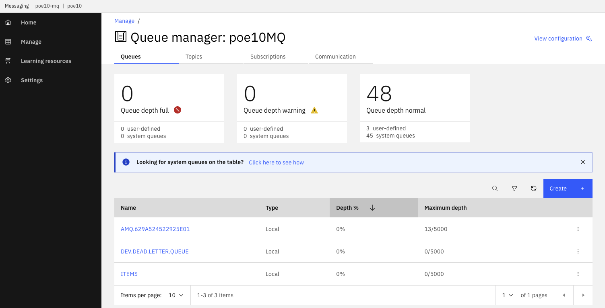
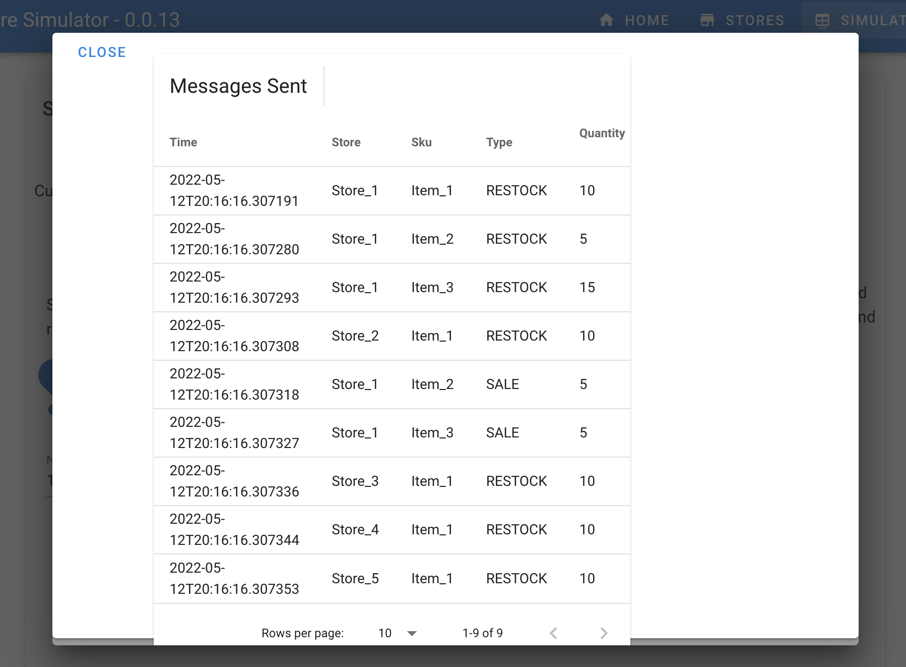

# Lab 3: Item inventory demonstration deployment

**Duration: 20 minutes**

## Goals

In this lab, you will learn how to deploy the real-time solution by simply using this repository and a minimum set of commands. The approach is to present reusable structure you may want to use for your own future proof of concept development, so it will be easy to demonstrate your solution.

The following diagram illustrates the components, you will deploy in your student's namespace using this repository.


### More context

A traditional solution may be organized with one git repository per application, and at least one GitOps repository to define the deployment artifacts. If you look at the demonstration you are running in this lab, the source code is in the public git account [ibm-cloud-architecture](https://github.com/ibm-cloud-architecture) with other repositories with following structure:


* [eda-rt-inventory-gitops](https://github.com/ibm-cloud-architecture/eda-rt-inventory-gitops): the solution gitops repo, built with [kam cli](https://github.com/redhat-developer/kam) which includes everything to declare ArgoCD apps and deployment descriptors
* [eda-gitops-catalog](https://github.com/ibm-cloud-architecture/eda-gitops-catalog): a git repository to define the different Cloud Pak for Integration operator versions.
* [store simulator application](https://github.com/ibm-cloud-architecture/refarch-eda-store-simulator) the simulator to send messages to different middleware
* [store aggregator / inventory application](https://github.com/ibm-cloud-architecture/refarch-eda-store-inventory) to compute store inventory aggregates with Kafka Streams
* [item aggregator / inventory application](https://github.com/ibm-cloud-architecture/refarch-eda-item-inventory) same for item inventory cross store.
## pre-requisites

See [Pre-requisites section](../lab1/index.md) in the main page.   
MAC users can run all the commands in this lab from terminal window.   
Windows users will have to run the commands from a WSL Command window. Open a CMD window and type 'bash' to enter the WSL prompt.   

## Preparation

Each Student will have received a unique identifier and will modify the current settings in this folder with their student id. 
All the current kubernetes configurations are currently set for `poe1`.

We assume the following are pre-set in you OpenShift cluster, which is the same as CoC integration cluster:

* Platform navigator is deployed in `cp4i` project.
* Event Streams is installed under `cp4i-eventstreams` project.

1. Login to the OpenShift cluster assigned to you (poe or ashoka) using the login command from the OpenShift Console

    

    Then copy this line:

    

    Accept the insecure connection

    ```sh
    oc login --token=sha256~q......pw --server=https://api.cody.coc-ibm.com:6443
    The server uses a certificate signed by an unknown authority.
    You can bypass the certificate check, but any data you send to the server could be intercepted by others.
    Use insecure connections? (y/n): y
    ```
    
1. Verify your `oc` cli works

    ```sh
    oc get nodes
    ```

1. Work under the `lab3-4` folder of this repository.

## Modify existing configuration

We will prepare the configuration for the following green components in figure below:



The blue components should have been deployed with the Cloud Pak for Integration deployment. 

1. The demonstration will run on its own namespace. The `env/base` folder includes the definition of the namespace, roles, role binding needed to deploy the demonstration. This is a classical way to isolate apps in kubernetes. 

    Running the `updateStudent.sh` shell script, will modify all the yaml files used by the solution with your student id. As an example we will be student `poe10` and the deployment will be done in `poe10` namespace. 

    * Mac User:

        ```sh
        export PREFIX=poe10
        ./updateStudent.sh
        ```
        
    * Windows user (in Linux shell)

        ```sh
        export PREFIX=poe10
        sudo dos2unix updateStudent.sh  
        ./updateStudent.sh
        ```

## Folder structure

This `lab3-4 `folder is a reduced version of what the Red Hat's [Kubernetes Application Management](https://github.com/redhat-developer/kam) tool is creating normally. If you want to see a full fledge GitOps version for this demonstration see the [eda-rt-inventory-gitops repository](https://github.com/ibm-cloud-architecture/eda-rt-inventory-gitops).

| Folder | Intent |
| --- | --- |
| **apps** | Defines deployment, config map, service and route for the 3 applications and kafka connector |
| **env** | Defines the namespace for each deployment, and some service account|
| **services** |Defines MQ broker instance, Kafka Connect cluster, and event streams topics|
| **argocd** | Define the ArgoCD project and apps to monitor this git repo. It will be used for lab 4 | 

## Deploy

The deployment will configure topics in event streams using a naming convention to avoid conflicts between students, deploy the three apps, deploy MQ broker and Kafka Connect cluster with the MQ source connector configured.


*Event Gateway, schema registry, and Cloud Object Storage sink connector are not used in this lab*

1. Start the deployment

    ```sh
    sudo make all-no-gitops
    ```

1. Verify the solution is up and running

    ```sh
    oc project $PREFIX
    oc get pods
    oc get routes 
    oc get kafkatopic -n cp4i-eventstreams
    oc get kafkauser -n  cp4i-eventstreams
    ```  
    

1. Access to the MQ console (replace the namespace and base url)

    ```sh
    # change poe to another server name if needed
    chrome https://cpd-cp4i.apps.poe.coc-ibm.com/integration/messaging/$PREFIX/$PREFIX-mq-ibm-mq/
    ```

1. Verify the queue manager has the ITEMS queue 

    

1. Access to the simulator console

    ```sh
    
    chrome http://$(oc get route store-simulator -o jsonpath='{.status.ingress[].host}')
    ```

    Go to the SIMULATOR tab. If you want to test with the MQ source connector, select IBMMQ backend, and starts the `Controlled scenario` to send predefined messages: 

    

    Normally you should not see the messages in the ITEMS queue as they are immediatly processed by the Kafka Connector. 

    You should get a set of predefined messages sent to MQ, and then to Kafka `$PREFIX-items` topic

    

    Go to the Event Streams console.

    If you select `Kafka` as backend, then the simulator sends directly the messages to Kafka `$PREFIX-items` topic.

1. The two other options for the Store simulator is to send from 1 to 100 random messages (left choice in the controller view), or continuously send messages (start / stop control in the middle of the page).

1. Access the Event Stream console to look at topic content:

```sh
# change poe to the OCP cluster name
chrome https://cpd-cp4i.apps.poe.coc-ibm.com/integration/kafka-clusters/cp4i-eventstreams/es-demo/
```

The `items` topic content the store transactions:


The `item.inventory` topic has the aggregates cross stores, as illustrates in figure below:


And the `store.inventory` includes events on current inventory per store:

 


???- "Read more on the demonstration script"
    [The demonstration instructions are in a separate note](https://ibm-cloud-architecture.github.io/eda-rt-inventory-gitops/demo-script/) as this is a demonstration available in the public git and shareable with anyone.

## Kafka connector configuration

The Kafka connect cluster is defined in [the kafka-connect.yam file](https://github.com/ibm-cloud-architecture/eda-tech-academy/blob/main/lab3-4/services/kconnect/kafka-connect.yaml) in the `services/kconnect` folder. The important part of this file is the Event Streams bootstrap server URL, the kafka version used, and the name of the topic used to persist states of the connector. Each student has its own topic names for offsets, config and status topics.

```yaml
  version: 3.0.0
  replicas: 2
  bootstrapServers: es-demo-kafka-bootstrap.cp4i-eventstreams.svc:9093
  image: quay.io/ibmcase/eda-kconnect-cluster-image:latest
  # ... 
  config:
    group.id: poe10-connect-cluster
    offset.storage.topic: poe10-connect-cluster-offsets
    config.storage.topic: poe10-connect-cluster-configs
    status.storage.topic: poe10-connect-cluster-status
    config.storage.replication.factor: 3
    offset.storage.replication.factor: 3
    status.storage.replication.factor: 3
```

Recall that the kafka connect cluster runs connectors in parallel and use Kafka consumer and producer API to do the data transfer.


The `image` references a custom image we built to have the MQ source connector and some sink. The Dockerfile for this image is in [this repository](https://github.com/ibm-cloud-architecture/eda-rt-inventory-gitops/tree/main/kconnect), you can start from it to add more connector.

To set the status of the kafka connect cluster runs the following command:

```sh
oc get kafkaconnect
# example of results
NAME                    DESIRED REPLICAS   READY
poe10-connect-cluster   2                  True
```

* The MQ source connector is defined as an app, in the `apps/mq-source` folder. Below are the important parts to consider:

```yaml
  config:
    mq.queue.manager: poe10MQ
    mq.connection.name.list: poe10-mq-ibm-mq.poe10.svc
    mq.channel.name: DEV.APP.SVRCONN
    mq.queue: ITEMS
    topic: poe10-items
    key.converter: org.apache.kafka.connect.storage.StringConverter
    value.converter: org.apache.kafka.connect.storage.StringConverter
    mq.record.builder: com.ibm.eventstreams.connect.mqsource.builders.DefaultRecordBuilder
    mq.connection.mode: client
    mq.message.body.jms: true
    mq.record.builder.key.header: JMSCorrelationID
  
```

We do not need to apply any logic on the value conversion. As the messages in MQ are json, we can just consider them as String. The `mq.record.builder.key.header: JMSCorrelationID` is very important to get the key from the MQ message header. This is a trick here to avoid having a kafks streams program to extract the key from the message and write to another topic, as it could be in real life. The [store simulator uses the JMSCorrelationID](https://github.com/ibm-cloud-architecture/refarch-eda-store-simulator/blob/22feb2baa4c57f2e8954acc7415f5d47f88130c7/backend/src/main/java/ibm/gse/eda/stores/infra/mq/MQItemGenerator.java#L120) to post the "StoreName" value as a a future key. The Kafka connector use this to write a kafka Producer Record with this key. 

```java
 public void sendMessage(Item item) {
    try {
      String msg = parser.toJson(item);
      TextMessage message = jmsContext.createTextMessage(msg);
      message.setJMSCorrelationID(item.storeName);
      producer.send(destination, message);
      ...
```

If you want to see the status of the connectors

```sh
oc get kafkaconnectors
# example of results
NAME        CLUSTER                 CONNECTOR CLASS                                           MAX TASKS   READY
mq-source   poe10-connect-cluster   com.ibm.eventstreams.connect.mqsource.MQSourceConnector   1           True
```


???- "Read more on Kafka connector"
    * [Techno overview](https://ibm-cloud-architecture.github.io/refarch-eda/technology/kafka-connect/)
    * [Event Streams Product documentation](https://ibm.github.io/event-streams/connecting/connectors/)
    * [Strimzi configuration](https://strimzi.io/docs/operators/latest/configuring.html#assembly-kafka-connect-str)
    * [Kafka documentation](https://kafka.apache.org/documentation/#connect)
    * [Kafka connector sink to cloud object storage](https://ibm-cloud-architecture.github.io/refarch-eda/use-cases/connect-cos/)
    * [Kafka connector sink to aws S3 with Camel connector](https://ibm-cloud-architecture.github.io/refarch-eda/use-cases/connect-s3/)

## Cleaning your OpenShift project

Run the following command to clean the demonstration deployment, specially if you will do next GitOps lab.

```sh
oc project $PREFIX
make clean
```
## Troubleshooting

### Message not sent to MQ

This could come from a connection issue between the simulator and MQ. Get the logs for the simulator pod:

```sh
oc get pod -l app.kubernetes.io/name=store-simulator
oc logs <pod_id>
```

## Running locally

Do this step ONLY if you do not have an openshift environment.  
You will require Docker to complete this step.  
During proof of concept development you can run Event Streams, MQ and your code on your own laptop with docker engine. We give you a docker compose file to do so. Here are the commands to run the same demonstration locally:

```sh
cd local
docker-compose up -d
./listTopics.sh
```

* Access simulator user interface at [http://localhost:8080](http://localhost:8080).
* Access MQ UI at [https://localhost:9443](https://localhost:9443).
* Access Kafdrop UI [http://localhost:9000](http://localhost:9000) to look at the topic content.

> [Next >> deploy with GitOps](../lab4)