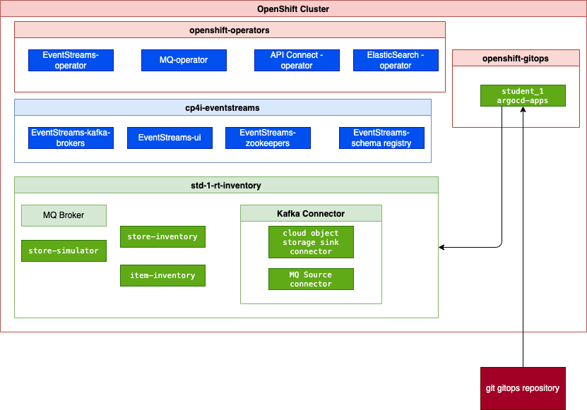

# GitOps deployment with Day 2 operations

In this exercise, you will use GitOps to deploy ArgoCD apps that monitor your git repository for any configuration changes you are doing via Pull Request or Git Commit operations and then apply those changes to the deployed applications.

The figure below illustrates the components involved:



In this lab the operators are already installed in the OpenShift cluster under the `openshift-operators` project, and products are already install too. So this lab is aimed to deploy the components of the real-time inventory demo (the green components in figure above).

As stated before you need to fork this repository under your own public git account, as all configurations will be monitored from your own git repository.
## Pre-Requisites

See [Pre-requisites section](../lab1/index.md) in the main page.   
MAC users can run all the commands in this lab from terminal window.   
Windows users will have to run the commands from a WSL Command window. Open a CMD window and type 'bash' to enter the WSL prompt.   

You should have completed / attempted Lab 3. Specifically, you should have run the "updateStudent.sh" script which makes namespace changes in the yaml files. 


## Deployment

1. Verify the OpenShift GitOps Operator is installed on your OpenShift cluster. In fact it should be installed, but this command may be helpful to you in your future proof of concepts.

    Work in the `eda-tech-academy/lab3-4` folder.

    ```sh
    make verify-argocd-available
    ```

    Should get this output if not installed

    ```sh
    Installing
    Complete
    ```

    Or this output if it is already installed.

    ```sh
    openshift-gitops-operator Installed
    ```

2. Prepare the ArgoCD app and project: Each student will have his/her own project within ArgoCD.

    * **Automatic way:**

    ```sh
    # under the lab3-4 folder
    export PREFIX=poe10
    export GIT_ACCOUNT=<yourname GIT account name>
    # same exported variables as before
    sudo make prepare-argocd
    ```   
   


	*  **Manual way:**.   
[Update the namespace, project, and repoURL elements in the `argocd/*.yaml` files.]

3. To get the ArgoCD `admin` user's password use the command

    ```sh
    oc extract secret/openshift-gitops-cluster -n openshift-gitops --to=-
    ```

4. Get the ArgoCD User Interface URL and open it in a web browser

    ```sh
	oc get route openshift-gitops-server -o jsonpath='{.status.ingress[].host}'  -n openshift-gitops

    ```

5. Verify you are able to login to the ArgoCD portal.

    

6. Go to applications and ensure there are no applications that have been created. 


7. Commit and push your changes to your gitops repository (The fork for eda-tech-academy).   
	You can use GitHub desktop or git CLI to push the changes to your repository. Here we are using the git CLI.

    * You can add a remote URl by replacing with your GitHub username in git.

    ```sh
    git remote add mine https://github.com/<yourusername>/eda-tech-academy.git
    ```

    ```sh
    git commit -am "update configuration for my student id"
    git push -u mine  
    Enter your github id and Token. 

    ```
    
    Please note Github requires Personal Access Token for Github Operations. You can refer here for more details.   
    [https://docs.github.com/en/authentication/keeping-your-account-and-data-secure/creating-a-personal-access-token](https://docs.github.com/en/authentication/keeping-your-account-and-data-secure/creating-a-personal-access-token)
    

8. Bootstrap Argocd:  

    ```sh
    make gitops
    ```

9. Verify in the ArgoCD console the apps are started and process the synchronization.

    

## Demonstration

You should be in the same state as in Lab 3 with the Simulator, the two kafka streams app, MQ and Kafka Connect

```sh
oc get pods
oc get kafkaconnectors
oc -n cp4i-eventstreams get kafkatopics
```

Lets do one simple test to see the imapct of ArgoCD.   
Edit this file: lab3-4/apps/item-inventory/base/deployment.yaml.  
and change spec.replicas to 2.  
Push you change to Github using GitHub Desktop or git CLI.
Wait for a few minutes and check the pods.  
> 	oc get pods.
  
You should see the replicas for item-inventory has increased. There should be 2 pods now.   
You can check ArgoCD view and see 2 pods. 

## Clean up

1. Full clean up the deployment

    If you want to stop working and clean the OpenShift cluster and event streams elements

    ```sh
    make clean-gitops
